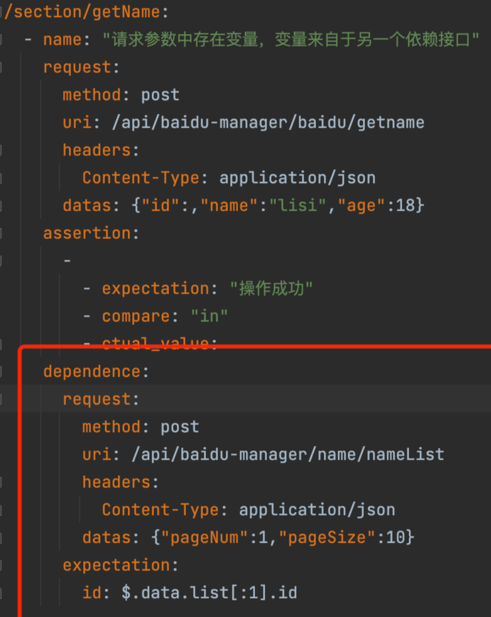
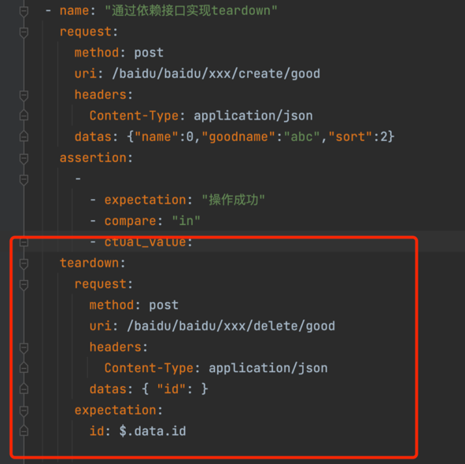

​

# 一、源码：
github地址：

https://github.com/18713341733/ApiFrame

或者可以下载 csdn ：

框架基本搭建完成了，这是最终版。有疑问需要交流的可以+v。

# 二、 实现功能
1、yml管理case 。在yml文件中编辑case

2、get 请求、post 请求 及返回结果的断言

3、与mysql数据库的交互封装

3、数据的传递与依赖：

a、实现了单例模式的全局字典，随时可以从字典中取数据、存数据

# 三、框架介绍
## 3.1 case编写
用户编写case时，需要写两个地方。

1、/data/ 下，yml文件，编写case所需数据

2、/test_case/下，编写case

## 3.2 登录信息维护
大部分的接口，请求，都需要带有token信息。登录信息的维护

登录账号维护：config/user.yml

账号登录并提取登录状态的请求：common/get_login_info.py

## 3.3 数据库信息维护
数据库配置信息：config/db.yml

封装数据库逻辑：

1、pytest 在启动项目时，先与mysql数据库建立连接，拿到conn信息。

在pytest 在项目结束时，关闭数据库连接。

test_case/conftest.py


```commandline
# 在执行项目代码之前，最先执行这个方法。autouse=True
@pytest.fixture(scope="session", autouse=True)
def setup():
    # TODO 在执行项目代码之前，最先执行这个方法
    print("启动建立数据库连接")
    # 测试项目资讯平台数据库连接
    baidu_manager_conn = get_baidu_manage_db_conn()
    print("===========开始执行项目===============")
    yield baidu_manager_conn
    print("关闭数据库连接")
    baidu_manager_conn.close()
```

## 3.4 变量值的来源
来源一： 全局大字典，通过get_value,set_value 方法，保存值，取值

来源二：

yml文件中的dependence（前置模块）、teardown(后置模块）



## 3.5 yml文件格式
对象，map(属性和值) （键值对）

```commandline
user:
  userName: "xiaoming"
  boss: true
  birth: 2022/07/13
  age: 20
```

行内写法:

```commandline
user:{userName: "小明",boss: true,birth: 2022/07/13,age: 20}

```
# 四、yml中编写case
## 4.1 注意事项
1、yml文件，是通过缩进表示层级关系的，所在xxx.yml文件中，编写case时，一定要注意缩进。

2、每个yaml文件是一个模块

3、每个模块下，编写case时。一定要保证 case 名称与接口名称一致。

## 4.2 yml中case讲解
```commandline
/api/abc/abc/abc/page:
  - name: "获取接口统一鉴权token"
    request:
      method: post
      url: /api/abcf/abc/abc/page
      headers:
        Content-Type: application/json
      datas:
        username: miaojiang
        password: 123456
    assertion:
      -
        - expectation: "'data':"
        - compare: "in"
        - ctual_value:
      -
        - expectation: "1"
        - compare: "="
        - ctual_value: "$.data.id"

```

1、yml中接口名称（/api/abc/abc/abc/page），必须与 接口文档中的接口名称保持一致

2、name 为当前case的名称

3、reqeust 填写请求需要的信息。

4、assertion: 断言

最少要有1个断言。上述代码中有2个断言。

expectation 为用户的期望值

compare 比较方式

ctual_value 为实际值。为空时，实际值取的整个response返回值。 想取具体某个字段时，需要使用jsonpath语法。 python中jsonpath的用法_python jsonpath_keer丶的博客-CSDN博客

jsonpath语法 在当前项目example中也有示例。

### 4.2.1 传参编写
1、传参为空

datas 后面为空就可以了

        Content-Type: application/json
      datas:
    assertion:
2、传参为josn，写法一

datas 后面直接跟一个字典。这个字典只能写一行。

      headers:
        Content-Type: application/json
      datas: {"username":"miaojiang","password":"123456","code":"1111"}
    assertion:

2、传参为josn，写法二

参数为key value的形式。

      datas:
        username: miaojiang
        password: 123456
    assertion:
### 4.2.2 headers编写
后台中，很多接口，都需要一个登录信息的鉴权。

是通过header里的 Authorization 进行鉴权的。 当case需要有这个信息时，在yml里的headers中可以写Authorization，也可以不写这个字段。 框架中，鉴权信息不是通过 headr控制的，是通过 编写case时，传参get_authorization控制的，如

def test_get_info(self,test_data:dict,get_authorization):

### 4.2.3 断言编写
代码如下：

    assertion:
      -
        - expectation: "操作成功"
        - compare: "in"
        - ctual_value:
      -
        - expectation: "admin"
        - compare: "="
        - ctual_value: "$.data.user.name"

1、支持多个断言

2、断言逻辑是，拿着期望值 expectation 与 实际值 ctual_value 做比较

3、ctual_value:为空时，表示实际值是整个接口返回值response

4、当实际值，想具体取接口返回值中的某一个字段时，使用jsonpath的写法。

如整个返回值为
```commandline

{
    'code': 200, 
    'msg': '操作成功', 
    'data': {
        'user': {
            'name': 'miaojiang', 
            'createTime': '2022-04-25 13:53:01', 
            'update': None, 

```

想要对比的实际值为data下，user 下的 name 字段。 写法为：

```commandline
- ctual_value: "$.data.user.name"
```

5、 比较方式 compare in 表示 期望值 在 实际值里面。

```commandline
> 期望值 大于 实际值

< 期望值，小于 实际值
```

# 五、py文件中case编写
类名，与方法名，必须以test_开头。

case 需要登录鉴权信息时，需要传入 get_authorization，如

def test_get_info(self,test_data:dict,get_authorization):

# 六、case中依赖数据的处理
##6.1 编写的接口，依赖另一个接口的数据，处理。在yml文件中，写被依赖的接口数据
举个例子。

```commandline
/goods/getgoods:
  - name: "演示：获取商品信息"
    request:
      method: post
      url: /api/abc/goods/getGoods
      headers:
        Content-Type: application/json
      datas: {"id": $id}
    assertion:
      -
        - expectation: "成功"
        - compare: "in"
        - ctual_value:
    dependence:
      request:
        method: post
        uri: /api/abc/goods/queryGoodsList
        headers:
          Content-Type: application/json
        datas: {"Platform":"","pageNum":1,"pageSize":10}
      expectation:
        id: $.data.list[:1].id


```
查询商品详情：/goods/getGoods:

url: /api/abc/goods/getGoods

需要传一个good id, 但是这个id 不能写死。 我先去获取 商品列表，queryGoodsList ,取第一个商品的 id,将这个id 传给查看 商品详情的接口。 在 getGoods 接口中，传参 id,写不写无所谓。怎么写都行。 重点在于dependence.expectation的取值。

id: $.data.list[:1].id

key：value

key 为 getGoods 接口中，传参datas 中的key， value ,取值，为依赖接口queryGoodsList 返回值中的，需要的字段取值 用的jsonpath语法

注意： 1、yml中，有依赖的场景再添加dependence， 没有依赖，就不需要添加 dependence 数据

2、dependence 中的uri，如果host 与主接口的host一致，就可以直接写uri，不用写host, http://xxx.xx.xx

如果依赖的接口host，与主接口的host不一致，则需要在dependence 中的uri 中，写全url的路径。

## 6.2 将依赖的数据进行参数化，从全局变量的字典中取值。
比如，修改商品 的 接口，这个商品的id，不能是写死的，是一个参数化的东西。

第一步：

我在yml文件中，写商品的id 时， 使用 ${id} 的形式。

方式一：datas所有数据写一行

datas: {"id": "${id}","status":"0"}

方式二：datas数据写多行

      datas:
          Platform: "abc"
          id: "${id}"
          imgUrl: "http://t"

或者

      datas:
          Platform: "abc"
          id: ${id}
          imgUrl: "http://t"
第二步：

在执行case之前，把变量id写到全局变量的字典中。 可以写在contest.py 文件中，也可以写到case py文件的setup中，如：

```commandline
class Test_GoodsController():
    """
    类名必须以Test_开头
    功能： 商品管理页面
    """
    def setup_class(self):
        """类的初始化"""
        # 设置全局变量，商品的id
        set_value("id",113)

```

# 7、数据问题
## 7.1 conftest实现数据，参数共享
conftest.py来实现数据，参数，方法、函数的共享。

方法：

function：每一个函数或方法都会调用
class：每一个类调用一次，一个类中可以有多个方法
module：每一个.py文件调用一次，该文件内又有多个function和class
session：是多个文件调用一次，可以跨.py文件调用，每个.py文件就是module
scope参数为session：所有测试.py文件执行前执行一次
scope参数为module：每一个测试.py文件执行前都会执行一次conftest文件中的fixture
scope参数为class：每一个测试文件中的测试类执行前都会执行一次conftest文件中的
scope参数为function：所有文件的测试用例执行前都会执行一次conftest文件中的fixture
## 7.2 全局变量
定义了一个全局变量类，GlobalDict

用来存放整个项目中用到的变量。 注意变量key的命名。

使用方法

```commandline
from common.global_dict import get_value,set_value

def test1():
    set_value("a","1112")
    pass

def test2():
    x=get_value("a")
    print(x)


if __name__ == '__main__':
    test1()
    test2()

```
# 八、case功能演示
## 8.1 普通的post请求，不依赖登录信息
data/case_demo2.yml

```commandline
/baidu/login:
  - name: "百度登录"
    request:
      method: post
      uri: /api/authbaidu/baidu/login
      headers:
        Content-Type: application/json
      datas:
        loginName: miaojiang
        password: 123456
    assertion:
      -
        - expectation: "操作成功"
        - compare: "in"
        - ctual_value:

```
test_case/test_demo2.py


```commandline
    @pytest.mark.parametrize("test_data", GetYml.getValue("/data/case_demo2.yml", "/baidu/login"))
    @allure.story("登录")
    def test_login(self,test_data:dict):
        b = GetResult.get_result(test_data)
        assert b == True
```

## 8.2 post请求，依赖登录信息
data/case_demo2.yml

```commandline
/baidu/computer/computer:
  - name: "私募产品信息-产品状态变更"
    request:
      method: post
      uri: /baidu-api/baidu/computer/edit-stats
      headers:
        Content-Type: application/json
      datas: {"id":123,"status":2}
    assertion:
      -
        - expectation: "操作成功"
        - compare: "in"
        - ctual_value:

```
test_case/test_demo2.py
```commandline

    @pytest.mark.parametrize("test_data", GetYml.getValue("/data/case_demo2.yml", "/baidu/computer/computer"))
    @allure.story("依赖登录信息请求post")
    def test_baidu_baidu_abc_stats(self, test_data: dict, get_authorization_and_token):
        b = GetResult.get_result(test_data, authorization=get_authorization_and_token[0],
                                 token=get_authorization_and_token[1])
        assert b == True
```

## 8.3 get请求，依赖登录信息
data/case_demo2.yml

```commandline
/baidu/xxx/delete-xxx-abc:
  - name: "get请求，依赖登录信息"
    request:
      method: get
      uri: /pe-api/baidu/xxx/delete-xxx-abc
      headers:
        Content-Type: application/json
      datas: {"name":"zhangsan"}
    assertion:
      -
        - expectation: "操作成功"
        - compare: "in"
        - ctual_value:
```

test_case/test_demo2.py

```commandline
    @pytest.mark.parametrize("test_data",
                             GetYml.getValue("/data/case_demo2.yml", "/baidu/xxx/delete-xxx-abc"))
    @allure.story("get请求，依赖登录信息")
    def test_baidu_baidu_abc_abc_fund(self, test_data: dict, get_authorization_and_token):
        b = GetResult.get_result(test_data, authorization=get_authorization_and_token[0],
                                 token=get_authorization_and_token[1])
        assert b == True
```

## 8.4一个接口，写多条case
data/case_demo1.yml
```commandline

/baidu/test/study/max:
  - name: "一个接口，写多条case1"
    request:
      method: post
      uri: /api/baidu/baidu/test/study/max
      headers:
        Content-Type: application/json
      datas: {"deliveryPlatform":2,"position":1}
    assertion:
      -
        - expectation: "操作成功"
        - compare: "in"
        - ctual_value:

  - name: "一个接口，写多条case2"
    request:
      method: post
      uri: /api/baidu/baidu/test/study/max
      headers:
        Content-Type: application/json
      datas: {"deliveryPlatform":2,"position":2}
    assertion:
      -
        - expectation: "操作成功"
        - compare: "in"
        - ctual_value:
```

test_case/test_demo1.py

```commandline
import allure
import pytest

from common.db_utils import DbUtils
from common.get_yml import GetYml
from common.get_result import GetResult
from common.global_dict import get_value,set_value

class Test_Demo1():

    @pytest.mark.parametrize("test_data", GetYml.getValue("/data/case_demo1.yml", "/baidu/test/study/max"))
    @allure.story("一个接口，写多条case")
    def test_baidu_get_study_max_sort(self, test_data: dict, get_authorization_and_token):
        b = GetResult.get_result(test_data, authorization=get_authorization_and_token[0],
                                 token=get_authorization_and_token[1])
        assert b == True

```
## 8.5 请求参数中存在变量，变量来自全局大字典
test_case/test_demo3.py

1、在初始化时，向全局大字典中，注入变量

```commandline
import allure
import pytest
from common.get_yml import GetYml
from common.get_result import GetResult
from common.global_dict import get_value,set_value


class Test_Demo3:

    def setup_class(self):
        """类的初始化"""
        # 设置全局变量
        set_value("test_id",2963)

    def teardown_class(self):
        pass

    @pytest.mark.parametrize("test_data", GetYml.getValue("/data/case_demo3.yml", "/baidu/product/hello"))
    @allure.story("请求参数中存在变量，变量来自全局大字典")
    def test_baidu_adc_derf(self,test_data:dict,get_authorization_and_token):
        b = GetResult.get_result(test_data,authorization=get_authorization_and_token[0],token=get_authorization_and_token[1])
        assert b == True
```

data/case_demo3.yml

编写case时，引用变量，使用 ${变量名称} 的方式引用

```commandline
/baidu/product/hello:
  - name: "请求参数中存在变量，变量来自全局大字典"
    request:
      method: post
      uri: /baiduapi/pe/jhg/hello
      headers:
        Content-Type: application/json
      datas: {"id":"${test_id}","name":"zhangsan","age":18}
    assertion:
      -
        - expectation: "操作成功"
        - compare: "in"
        - ctual_value:
```

## 8.6 请求参数中存在变量，变量来自于另一个依赖接口
/baidu/getname 接口参数中的id,依赖/name/nameList 请求的返回值。

通过dependence:模块实现

test_case/test_demo4.py

```commandline
import allure
import pytest

from common.db_utils import DbUtils
from common.get_yml import GetYml
from common.get_result import GetResult
from common.global_dict import get_value,set_value
import os


class Test_demo4:

    @pytest.mark.parametrize("test_data", GetYml.getValue("/data/case_demo4.yml", "/section/getName"))
    @allure.story("请求参数中存在变量，变量来自于另一个依赖接口")
    def test_section_detail_news(self,test_data:dict,get_authorization_and_token):
        b = GetResult.get_result(test_data, authorization=get_authorization_and_token[0],
                                 token=get_authorization_and_token[1])
        assert b == True

```
data/case_demo4.yml

/baidu/getname 接口参数中的id,依赖 /name/nameList 请求的返回值

1、先对依赖接口dependence: 中的url：/api/baidu-manager/name/nameList 做请求。

2、然后提取 返回值

```commandline
expectation:
        id: $.data.list[:1].id
```

生成了一个字典。这个字典会传给 真正case的接口。

这里在依赖接口的返回结果中，提取值，使用的是jsonpath方法。

3、在真正case的接口请求中，"id“：的值为空就可以了。

```commandline
datas: {"id":,"name":"lisi","age":18}
```
```commandline

/section/getName:
  - name: "请求参数中存在变量，变量来自于另一个依赖接口"
    request:
      method: post
      uri: /api/baidu-manager/baidu/getname
      headers:
        Content-Type: application/json
      datas: {"id":,"name":"lisi","age":18}
    assertion:
      -
        - expectation: "操作成功"
        - compare: "in"
        - ctual_value:
    dependence:
      request:
        method: post
        uri: /api/baidu-manager/name/nameList
        headers:
          Content-Type: application/json
        datas: {"pageNum":1,"pageSize":10}
      expectation:
        id: $.data.list[:1].id

```
## 8.7 通过依赖接口实现setup 与teardown
### 8.7.1 通过依赖接口实现setup
8.6 中已经实现了setup

### 8.7.2通过依赖接口实现teardown
通过dependence:模块实现

test_case/test_demo4.py

```commandline
    @pytest.mark.parametrize("test_data", GetYml.getValue("/data/case_demo4.yml",
                                                          "/create/good"))
    @allure.story("通过依赖接口实现teardown")
    def test_baidu_create_good(self, test_data: dict, get_authorization_and_token):
        b = GetResult.get_result(test_data, authorization=get_authorization_and_token[0],
                                 token=get_authorization_and_token[1])
        assert b == True

```
data/case_demo4.yml

case解释：

要对创建商品的接口写case，/baidu/baidu/xxx/create/good。

创建完商品后，需要调用/baidu/baidu/xxx/delete/good

把刚刚创建的商品删除掉。

/delete/good 删除接口，需要获取上一个接口创建的商品的id。 通过

```commandline
expectation:
        id: $.data.id
```

对上一个接口的数据进行提取。 在删除接口的参数中，id为空就可以。

```commandline
datas: { "id": }
```
```commandline

/create/good:
  - name: "通过依赖接口实现teardown"
    request:
      method: post
      uri: /baidu/baidu/xxx/create/good
      headers:
        Content-Type: application/json
      datas: {"name":0,"goodname":"abc","sort":2}
    assertion:
      -
        - expectation: "操作成功"
        - compare: "in"
        - ctual_value:
    teardown:
      request:
        method: post
        uri: /baidu/baidu/xxx/create/good
        headers:
          Content-Type: application/json
        datas: { "id": }
      expectation:
        id: $.data.id
```

## 8.8 通过sql实现setup 与teardown
直接在 setup_class 与teardown_class 中执行sql就可以了。

不区分sql的类型（删除或者查询类型等），统一调用

DbUtils.execute_sql 方法
```commandline
class Test_demo4:

    def setup_class(self):
        """类的初始化"""
        # 设置咨询的id
        set_value("id",1732)

        # 通过sql删除数据
        delete_news_sql = "delete from db_name.table_name where title='接口自动化测试自动删除';"
        DbUtils.execute_sql(get_baidu_manage_db_conn(), delete_news_sql)

    def teardown_class(self):
        # 删除banner
        delete_banner_sql = "delete from db_name.table_name where title='接口自动化测试自动删除';"
        DbUtils.execute_sql(get_baidu_manage_db_conn(), delete_banner_sql)

```
注意：

sql语句中，要使用库名.表名的形式，不可以直接使用表名，如
```commandline

"delete from db_name.table_name where title='接口自动化测试自动删除';"

```
## 8.9通过接口请求实现setup 与teardown
想要在 setup_class 与teardown_class 中执行接口的请求，

直接调用SetupTeardown.request(）方法对接口进行请求就可以了。

注意： 在 SetupTeardown.request(） 的请求中，需要token，或者 其他认证信息，在编写yml  请求时，使用 ${token} 代替。

data/case_demo5.yml

```commandline
setup_teardown_/baidu/baidu/baidu/edit-status:
  - name: "设置字典状态为失效"
    request:
      method: post
      uri: /baidu-api/baidu/baidu/baidu/edit-status
      headers:
        Content-Type: application/json
        Authorization: "${Authorization}"
        token: "${token}"
      datas: {"id":"${baidu_dict_id}","status":0}
    assertion:
      -
        - expectation: "操作成功"
        - compare: "in"
        - ctual_value:


setup_teardown_/baidu/baidu/baidu/deleted:
  - name: "baidu-删除字典"
    request:
      method: post
      uri: /pe-baidu/baidu/baidu/baidu/deleted
      headers:
        Content-Type: application/json
        Authorization: "${Authorization}"
        token: "${token}"
      datas: {"id": "${baidu_key_dict_id}"}
```

test_demo5.py

```commandline
import allure
import pytest
from common.get_yml import GetYml
from common.get_result import GetResult
from common.global_dict import get_value,set_value,has_key
from common.setup_teardown import SetupTeardown


class Test_Demo5r:

    def setup_class(self):
        """类的初始化"""
        # 设置id
        set_value("baidu_key_dict_id",54)
        # 设置id
        set_value("baidu_key_dict_id","151422")
        # 创建字典
        SetupTeardown.request("/data/case_demo5.yml", "setup_teardown_/baidu/baidu/baidu/edit-status")


    def teardown_class(self):
        # 删除字典
        SetupTeardown.request("/data/case_demo5.yml", "setup_teardown_/baidu/baidu/baidu/deleted")

```
# 九、使用git远程连接&上传&下载项目
## 9.1 用户权限问题：本地生成密钥，gitlab后台端绑定公钥
### 9.1.1 本地生成密钥
--------设置用户名，邮箱（Git global setup）

git config --global user.name "喵酱"
git config --global user.email "miaojaing@163.com"

------生成本地密钥 1.查看是否已经有了ssh密钥：cd ~/.ssh 如果没有密钥则不会有此文件夹，有则备份删除 2.生成密钥： ssh-keygen -t rsa -C 'miaojaing@163.com' 按3个回车，密码为空。

------------github后台端绑定公钥 公钥信息：

cat ~/.ssh/id_rsa.pub

将公钥信息，复制到github 后台 点击右上角自己的头像----Settings----SSh Keys-----添加公钥信息

## 9.2 项目里没有仓库，直接在gitlab上新建一个仓库
```commandline
git clone http://xxx/ApiFrame.git
cd ApiFrame
touch README.md
git add README.md
git commit -m "add README"
git push -u origin master
```


## 9.3 github上项目里，没有仓库，将本地存在的一个项目，推上去
```commandline
cd existing_folder
git init
git remote add origin http://xxxxxx/ApiFrame.git
git add .
git commit -m "Initial commit"
git push -u origin master

```
## 9.4 存在仓库 Existing Git repository
```commandline
cd existing_repo
git remote add origin http://xxxx/ApiFrame.git
git push -u origin --all
git push -u origin --tags

```
# 十、常用命令
requirements.txt相关命令
1、安装

python3 -m pip install pipreqs

2、在当前目录生成

pipreqs . --encoding=utf8 --force

3、在当前环境，导入依赖包

python3 -m pip install -r requirements.txt

# 十一、python 命名规范
编码
如无特殊情况, 文件头部必须加入#--coding:utf-8--标识

包名 package
包名尽量短小，并且全部使用小写字母，不推荐使用下划线。例如：box、top、game、fun等。

模块命名，模块(module)其实就是py文件
模块名尽量短小，并且全部小写字母，可以使用下划线连接多个单词。例如：value、game_value等。(value是我经常用的一个单词)

类名命名
类名使用驼峰(CamelCase)命名风格，首字母大写，私有类可用一个下划线开头，如

class Farm():

class AnimalFarm(Farm):

class _PrivateFarm(Farm):

函数命名
函数名一律小写，如有多个单词，用下划线隔开，如

def run_with_env()

私有函数在函数前加一个下划线，如：

def _private_func():

变量命名
变量名尽量小写, 如有多个单词，用下划线隔开，如

school_name = "一中"

常量命名
常量使用以下划线分隔的大写命名

MAX_OVERFLOW = 100

yml文件命名
全部小写，多个单词 以 - 分割。如：

application-dev.yml，application-prod.yml

case命名规范
case名称，要与接口名称保持一致。且用下划线隔开

如接口名称为 /system/menu

则case命名应该为 def test_system_menu()

# 十二、jsonpath 学习
练习地址：

JSONPath Online Evaluator

相关博客：JsonPath完全介绍及详细使用教程_软件测试情报局的博客-CSDN博客

字典中，嵌套list，取list中第一个元素的id值 $.data.list[:1].id

# 十三、json(字符串)、字典相互转换
13.1 将字符串转成字典
使用ast

import ast
user = '{"name" : "john", "gender" : "male", "age": 28}'
user_dict = ast.literal_eval(user)

如果使用 json （json.loads）进行转换存在不能使用单引号的问题。

json 语法规定 数组或对象之中的字符串必须使用双引号，不能使用单引号，会报错。


​